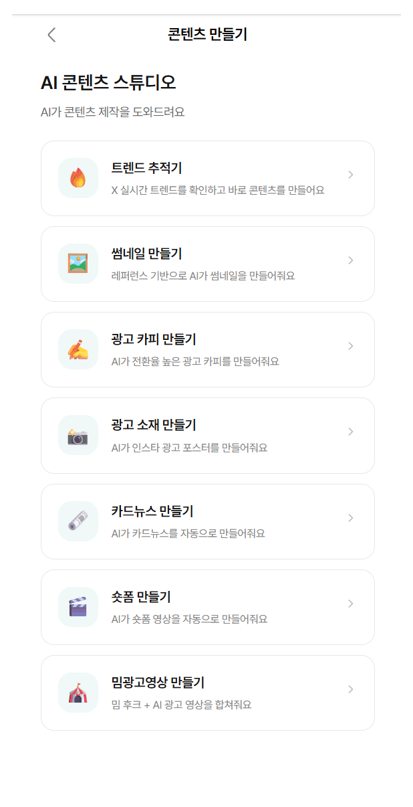

<div align="center">

# Contents Maker

### Generate short-form videos, ad creatives, and card news — entirely in the browser. No FFmpeg. No GPU server.

<br/>



<br/>

**Topic Input → AI Script → 18 Motion Styles → MP4 Export** — zero server-side rendering

<br/>

[](https://www.typescriptlang.org/)
[](https://react.dev/)
[](https://www.remotion.dev/)
[](https://supabase.com/)
[](https://ai.google.dev/)
[](./LICENSE)

[English](#how-it-works) | [한국어](#한국어)

</div>

---

## Why this exists

Most AI video tools require GPU servers, FFmpeg pipelines, or expensive SaaS subscriptions.

**Contents Maker renders videos directly in the browser** using `Canvas` + `WebCodecs` + `mp4-muxer`. The AI generates scripts and images via Supabase Edge Functions — the browser does the rest.

Built as the production content engine behind [nadaunse.com](https://nadaunse.com). Now open source.

---

## How it works

```
You type a topic
     ↓
Gemini AI writes a scene-by-scene script (JSON)
     ↓
AI generates images (Gemini) or videos (Replicate I2V)
     ↓
ElevenLabs / OpenAI synthesizes narration
     ↓
Remotion previews → Canvas + WebCodecs encodes MP4
     ↓
Download. Done.
```

---

## 7 Tools

| Tool | What it does | AI |
|------|-------------|-----|
| **Trend Tracker** | Real-time X trending + AI topic analysis | Gemini + Google Search Grounding |
| **Short-form Video** | 10/15/30s vertical videos with 18 motion graphics | Gemini + ElevenLabs TTS + Remotion |
| **Meme Ad Video** | Meme hook clip + AI ad scene synthesis | Gemini + WebCodecs |
| **Card News** | AI-generated slide decks with stock/AI images | Gemini Image Generation |
| **Ad Copy** | Behavioral economics-based copywriting | Gemini |
| **Ad Creative** | Full ad poster with AI image | Gemini Image Generation |
| **Thumbnail** | Reference-based AI thumbnail + batch generation | Gemini Image Generation |

---

## Video Engine

The core differentiator. **100% browser-side rendering** — no FFmpeg, no GPU server.

| Feature | Detail |
|---------|--------|
| Rendering | `Canvas` + `WebCodecs` + `mp4-muxer` (H.264 + AAC) |
| Preview | Remotion 4 `TransitionSeries` + 7 transition types + Light Leaks |
| Motion Graphics | **18 styles** — keyword pop, typewriter, glitch, parallax, emoji rain, etc. |
| Video Types | Motion graphics / AI image (Ken Burns) / AI video (Replicate I2V) |
| Audio | TTS narration + BGM with automatic ducking |
| Audio Reactive | Glow pulse, beat flash, waveform (frame-based, no `@remotion/media-utils`) |
| Meme Ads | Hook frame extraction + AI ad scene + `OfflineAudioContext` mixing |
| Export | MP4 download + CapCut project JSON + ZIP |

<details>
<summary><b>18 Motion Styles</b></summary>

| Style | Effect |
|-------|--------|
| `keyword_pop` | Spring pop-in with keyword emphasis |
| `typewriter` | Typing effect with cursor |
| `slide_stack` | Left/right slide stacking |
| `counter` | Animated number count-up |
| `split_compare` | Side-by-side comparison with VS |
| `radial_burst` | Radial burst animation |
| `list_reveal` | Sequential list item reveal |
| `zoom_impact` | Zoom-in with shockwave |
| `glitch` | RGB split glitch effect |
| `wave` | Wave text animation |
| `spotlight` | Circular spotlight reveal |
| `card_flip` | 3D card flip |
| `progress_bar` | Horizontal progress bar |
| `emoji_rain` | Falling emoji particles |
| `parallax_layers` | Multi-layer parallax |
| `confetti_burst` | Confetti explosion |
| `sparkle_trail` | Sparkle trail effect |
| `pulse_ring` | Expanding pulse rings |

</details>

---

## Quick Start

```bash
git clone https://github.com/mochunab/contents-maker.git
cd contents-maker
npm install
cp .env.example .env   # fill in your Supabase URL + anon key
npm run dev
```

Then deploy the 13 Edge Functions to your Supabase project:

```bash
npx supabase link --project-ref your-project-ref
npx supabase functions deploy
```

Set API keys in **Supabase Dashboard > Project Settings > Edge Functions > Secrets**.

### API Keys

| Service | Env Variable | Get it | Free Tier |
|---------|-------------|--------|-----------|
| **Google Gemini** | `GOOGLE_API_KEY` | [ai.google.dev](https://ai.google.dev/gemini-api/docs/api-key) | 15 RPM free |
| **ElevenLabs** | `ELEVENLABS_API_KEY` | [elevenlabs.io](https://elevenlabs.io/app/settings/api-keys) | 10K chars/mo |
| **OpenAI** (TTS fallback) | `OPENAI_API_KEY` | [platform.openai.com](https://platform.openai.com/api-keys) | Pay-per-use |
| **Replicate** (I2V) | `REPLICATE_API_TOKEN` | [replicate.com](https://replicate.com/account/api-tokens) | Pay-per-use |
| **Unsplash** | `UNSPLASH_ACCESS_KEY` | [unsplash.com/developers](https://unsplash.com/developers) | 50 req/hr |
| **Pexels** | `PEXELS_API_KEY` | [pexels.com/api](https://www.pexels.com/api/new/) | 200 req/hr |
| **Apify** | `APIFY_API_TOKEN` | [console.apify.com](https://console.apify.com/account/integrations) | $5/mo free |
| **Jamendo** | `JAMENDO_CLIENT_ID` | [devportal.jamendo.com](https://devportal.jamendo.com/) | 35K req/mo |
| **Supabase** | `VITE_SUPABASE_URL` + `ANON_KEY` | [supabase.com](https://supabase.com/dashboard) | Free tier |

---

## Architecture

```
Browser (React 18 + TypeScript + Tailwind v4)
├── Remotion Player ── real-time video preview
├── Canvas + WebCodecs + mp4-muxer ── browser-side MP4 encoding
├── 18 Motion Graphics ── spring animations, glitch, parallax…
├── Lottie Overlays ── 10 animated overlay effects
└── Audio Reactive Visuals ── frame-based beat simulation

Supabase Edge Functions (Deno) — 13 functions
├── Gemini 2.5 Flash ── script / copy / creative generation
├── Gemini Flash Image ── AI image generation
├── ElevenLabs / OpenAI TTS ── narration synthesis
├── Replicate (Wan 2.5 / Hailuo / Kling) ── Image-to-Video
├── Jamendo ── royalty-free BGM
├── Unsplash + Pexels ── stock images
└── Apify ── X trending data
```

<details>
<summary><b>Project Structure</b></summary>

```
src/
├── pages/                    # 8 page components
├── shortform/                # Video rendering engine
│   ├── renderVideo.ts        # Canvas + WebCodecs MP4 encoder
│   ├── lottie/               # Lottie overlay system
│   └── compositions/         # Remotion components + 18 motions
├── meme-ad/                  # Meme ad video engine
└── capcut/                   # CapCut project export

supabase/functions/           # 13 Edge Functions
public/lottie/                # 10 Lottie animation assets
```

</details>

---

## Browser Requirements

- **Chrome / Edge** (WebCodecs API required)
- Desktop recommended

---

## Documentation

- **[Technical Handover](./docs/CONTENT_STUDIO_HANDOVER.md)** — Full specification for all 7 makers + 13 Edge Functions

---

## 한국어

### 빠른 시작

```bash
git clone https://github.com/mochunab/contents-maker.git
cd contents-maker
npm install
cp .env.example .env   # VITE_SUPABASE_URL, VITE_SUPABASE_ANON_KEY 입력
npm run dev
```

Edge Functions 배포:

```bash
npx supabase link --project-ref your-project-ref
npx supabase functions deploy
# API 키는 Supabase Dashboard > Edge Functions > Secrets에서 설정
```

### 이게 뭔가요?

**Contents Maker**는 브라우저에서 숏폼 영상, 광고 소재, 카드뉴스를 만드는 AI 콘텐츠 스튜디오입니다. FFmpeg 서버 없이 `Canvas` + `WebCodecs`로 MP4를 렌더링합니다.

[nadaunse.com](https://nadaunse.com) (나다운세)의 내부 콘텐츠 엔진으로 개발 후 오픈소스로 공개했습니다.

### 7개 도구

| 도구 | 설명 | AI |
|------|------|----|
| **트렌드 추적기** | X 실시간 트렌딩 + AI 주제 분석 | Gemini + Google Search |
| **숏폼 메이커** | 10/15/30초 세로 영상 + 모션 18종 | Gemini + ElevenLabs TTS + Remotion |
| **밈광고 메이커** | 밈 훅 영상 + AI 광고 대본 합성 | Gemini + WebCodecs |
| **카드뉴스 메이커** | AI 슬라이드 기획 + 스톡/AI 이미지 | Gemini Image |
| **광고 카피 메이커** | 행동경제학 기반 광고 카피 | Gemini |
| **광고 소재 메이커** | AI 광고 포스터 디자인 | Gemini Image |
| **썸네일 메이커** | 레퍼런스 기반 AI 썸네일 + 배치 | Gemini Image |

### 영상 엔진

- **100% 브라우저 렌더링** — FFmpeg/GPU 서버 불필요
- **모션 그래픽 18종** — 키워드 팝, 타이핑, 글리치, 패럴랙스, 이모지 비 등
- **영상 3종** — 모션 / AI 이미지 (Ken Burns) / AI 영상 (I2V)
- **오디오** — TTS 나레이션 + BGM 자동 더킹
- **CapCut 내보내기** — 프로젝트 JSON + TTS ZIP

### 광고 전략

행동경제학 기반 10가지 전략이 AI 프롬프트에 내장:

| 분류 | 전략 |
|------|------|
| 행동경제학 | 손실 회피, 구체적 숫자, 타겟 지목, 간편성/즉각성 |
| 카피 유형 | 문제점 자극형, 이익 약속형, 호기심 유발형, 해결책 제시형, 질문 유도형, 행동 촉구형 |

---

<div align="center">

### Built with

**Gemini** | **Remotion** | **WebCodecs** | **Supabase** | **ElevenLabs** | **Replicate**

MIT License

If this project is useful, a star helps others discover it.

</div>
